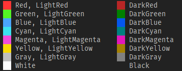
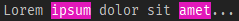
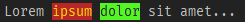
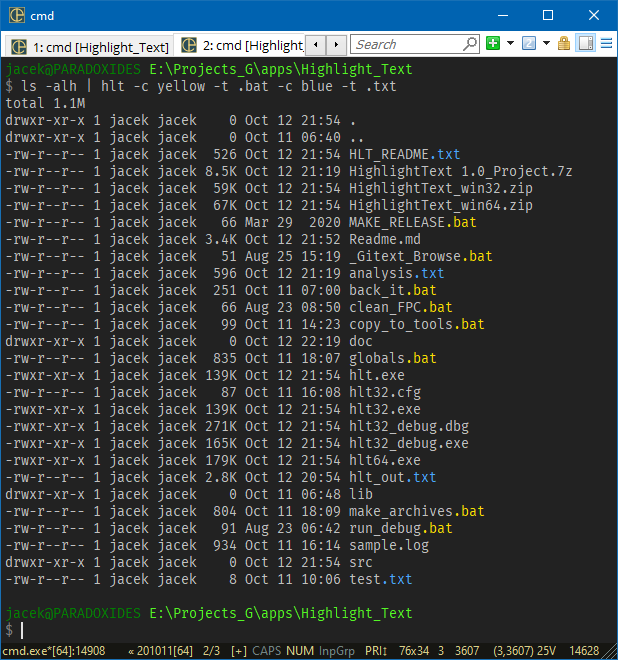
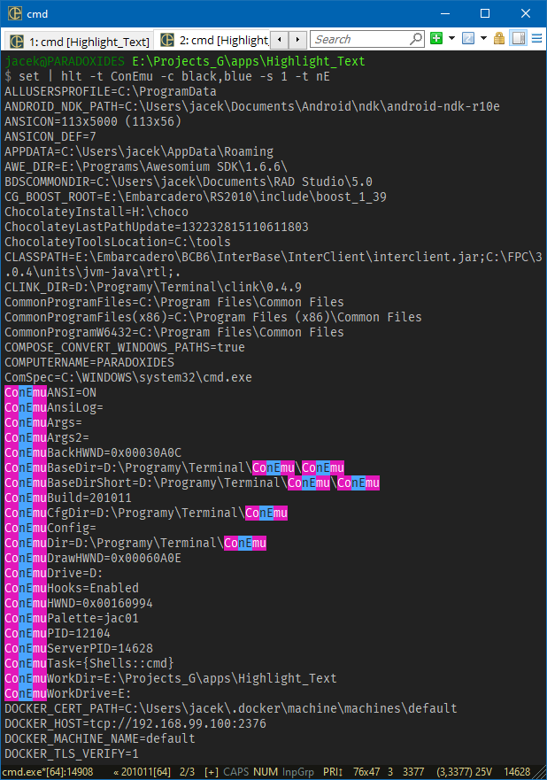

# Highlight Text

A small command-line utility which highlights the given substring in the specified text with the specified color.

## Download

Source: https://github.com/jackdp/Highlight-Text

Compiled binaries (Windows 32-bit and 64-bit): http://www.pazera-software.com/products/highlight-text/

## Usage

`hlt.exe TEXT [-c=COLORS] [-s=1|0] [-t=STR] [-l] [-h] [-V] [--license] [--home]`

Mandatory arguments to short options are mandatory for long options too.
Options are case-sensitive. Options and values in square brackets are optional.
You can use the `-t`, `-c`, and `-s` options multiple times.

### Options

| Option                              | Description                                                               |
|-------------------------------------|---------------------------------------------------------------------------|
| `-t`, `--highlight-text=STR`        | Text to be highlighted.                                         |
| `-c`, `--colors=FgColor[,BgColor]`  | The foreground and background color used to highlight the specified text. See the list of available colors below. |
| `-s`, `--case-sensitive=1/0`  | Consider the character case when searching for the text to highlight. By default `-s=0` (not case sensitive) |
| `-l`, `--log-colors`                | Highlight some special words used in the logs such as Error, Failed, Warning, Success etc. |
| `-h`, `--help`                      | Show this help.                                                           |
| `-V`, `--version`                   | Show application version.                                                 |
| `--license`                         | Display program license.                                                  |
| `--home`                            | Opens program homepage in the default browser.                            |

### TEXT

Text can be given on the command line or/and redirected from an external command via a pipe.
You can provide multiple text values in any combination with the options.

### Available colors

Fuchsia = LightMagenta  
Lime = LightGreen  
Color names are case insensitive.

### Exit codes

| Exit code | Description   |
|-----------|---------------|
| 0         | OK (no error) |
| 1         | Other error   |
| 2         | Syntax error  |

## Examples

1. Highlight the word `ipsum` and `amet` with the default colors:  
  `hlt "Lorem ipsum dolor sit amet..." -t ipsum -t amet`  
  Result:  
  

2. Highlight the word `ipsum` with the red color, and word `dolor` with the lime color:  
  `hlt "Lorem ipsum dolor sit amet..." -c yellow,darkred -t ipsum -c black,lime -t dolor`  
  Result:  
  

3. Highlight the file extension `.txt` and `.bat` in the file list returned by the **ls** command:  
  `ls -alh | hlt -c yellow -t .bat -c blue -t .txt`  
  Result:  
  

4. Nested highlighting. Highlight the text `ConEmu` and `nE` in the variable list returned by the **set** command:  
  `set | hlt -t ConEmu -c black,blue -s 1 -t nE`  
  Result:  
  

## Compilation

To compile, you need the [Lazarus IDE](https://www.lazarus-ide.org/) and several units from the [JPLib](https://github.com/jackdp/JPLib) package.

How to build:

1. Install **JPLib** package in the Lazarus IDE.
1. Open `src\HighlightText.lpi` file with the Lazarus.
1. Build project (menu `Run->Build`).

## Releases

2020.10.13 - Version 1.0
